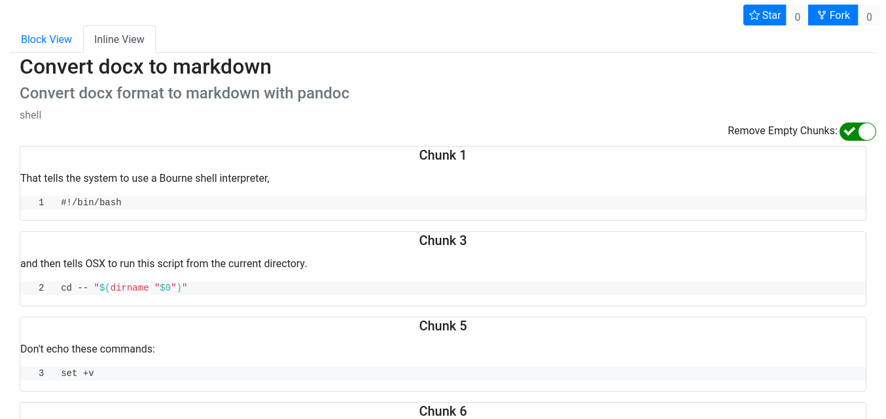

[](https://lbesson.mit-license.org/)  [](https://app.circleci.com/pipelines/github/sehnsucht13/code-drop)
# code-drop
code-drop is a web application made to share code snippets using [literate programming](https://en.wikipedia.org/wiki/Literate_programming). Its original inspiration came from Github's [Gists](https://gist.github.com/discover).

Some snippets/Gists can contain too many comments and be overly verbose. While this is good for learning purposes, the code contained in the snippet/Gist can sometimes be hard to read due to the amount of comments surrounding it.

code-drop aims to reduce the verbosity that can sometimes come with snippets and let users focus only on the code. This is done by giving users the ability to "annotate" a snippet. All annotations provided by a snippet author can then be toggled on demand.

## Using code-drop
The application is deployed on [heroku](https://code-drop.herokuapp.com/).

**NOTE:** The application is deployed using Heroku's free tier. If there is no activity for 30 minutes then Heroku's dyno's go to sleep. This means that the application may take 10-15 seconds to load on the first request while the dyno is being woken up.

## Example
The snippet below is borrowed from [this gist](https://gist.github.com/arthurattwell/44713ec1a870c075eb5e8d7c3ef600ee) created by [Arthur Attwell](https://gist.github.com/arthurattwell).
The original gist for a shell script looks like:
```sh
#!/bin/bash
cd -- "$(dirname "$0")"
# That tells the system to use a Bourne shell interpreter,
# and then tells OSX to run this script from the current directory.
# Don't echo these commands:
set +v

repeat=

while [ "$repeat" = "" ]
do
    # Clear any preexisting filename variables
    filename=
    # Ask which file we're converting.
    echo "Which file? (Don't include the .docx file extension): "
    read filename
    # Feedback
    echo "Running pandoc..."
    # Run pandoc
    pandoc -f docx -t markdown_mmd "$filename".docx --output="$filename".md --atx-headers --wrap=none --toc --extract-media=""
    # Feedback
    echo "Done. Ready for another file."
    # Let the user easily run that again
    repeat=
    echo "Hit enter to convert another file, or any other key and enter to stop. "
    read repeat
    # Otherwise end
done
```
Using code-drop, the outright verbosity of this snippet will be reduced and anybody reading it will have the ability to view comments only for lines/content that they are uncertain of. code-drop supports viewing snippets and their annotations in two views:
### Block View

### Inline View


# Another one


## Disclaimer
This is something that I made for both fun and educational purposes. It is not meant to be used in any serious capacity.

